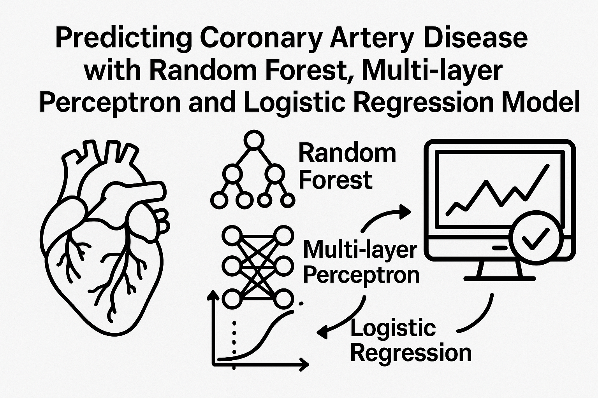

# Computer Engineer

**Programming Skills:** Python, SQL, C, C++, Java, js, Laravel, Django, PHP, AWS, Git  
**Simulation Software:** LTSpice, Proteus, Wireshark, Oracle Virtual Box, 8086 emulator, Cisco Packet Tracer, MATLAB

## Education

- **B.S. CSE** | BRAC University, Dhaka, Bangladesh (_2021 - 2025_)  
  _CGPA: ****_

- **H.S.C. Science** | Adamjee Cantonment College, Dhaka, Bangladesh (_2017 - 2019_)  
  _GPA: 5.00_

- **S.S.C. Science** | Bangladesh International School, Dhaka, Bangladesh (_2017_)  
  _GPA: 5.00_

## Work Experience
**Bangladesh Military Academy (_2019-2020_)**
- As an Officer Cadet at the Bangladesh Military Academy, I underwent rigorous training in leadership, military tactics, and physical fitness. This program would have prepared me to become a commissioned officer in the Bangladesh Army, focusing on discipline, strategic thinking, and the ability to lead and manage troops in various combat and operational settings.

## Projects
### Online Learning Platform
[LMS](https://github.com/fzn011/Learning-Website)

The project uses Laravel 10 as the PHP framework, with MySQL for database management and XAMPP for the local server. Bootstrap is used for the responsive frontend, and development is done using Visual Studio Code. The Breeze Package implements multi authentication functionality.

### Password Protection System 

[Password Protection System](https://drive.google.com/drive/folders/1zQAG-bZvKv7j8okOovvjWUiQjUB8WUMX)

The project designs a Password Protection System using XOR, AND, and NOT gates. It compares a 4-bit key code with user input; if they match, a green LED lights up, and if not, a red LED shows. This system demonstrates how digital logic gates can be used for security by validating passwords.

###  Predicting Coronary Artery disease with Random Forest, Multi-layer Perceptron and Logistic Regression Models

[Cardiovascular_Disease_Prediction](https://github.com/fzn011/Cardiovascular_Disease_Prediction)

Developed a machine learning-based model to predict cardiovascular diseases using data such as age, cholesterol, and blood pressure. Implemented Random Forest, Logistic Regression, and Multi-layer Perceptron models to classify patients as healthy or at risk. Achieved high accuracy with Random Forest (98% on training data), and evaluated models using metrics like precision, recall, and F1-score.

